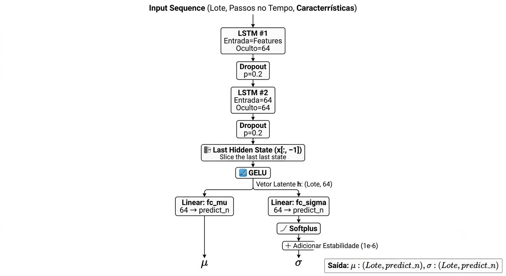
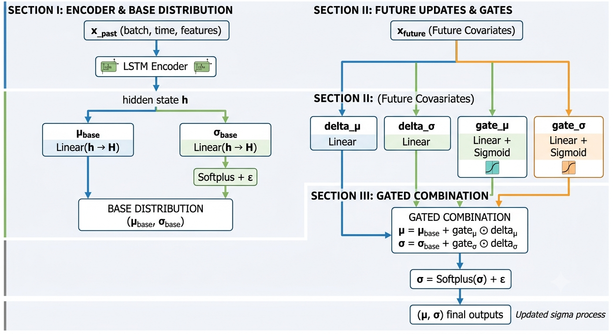
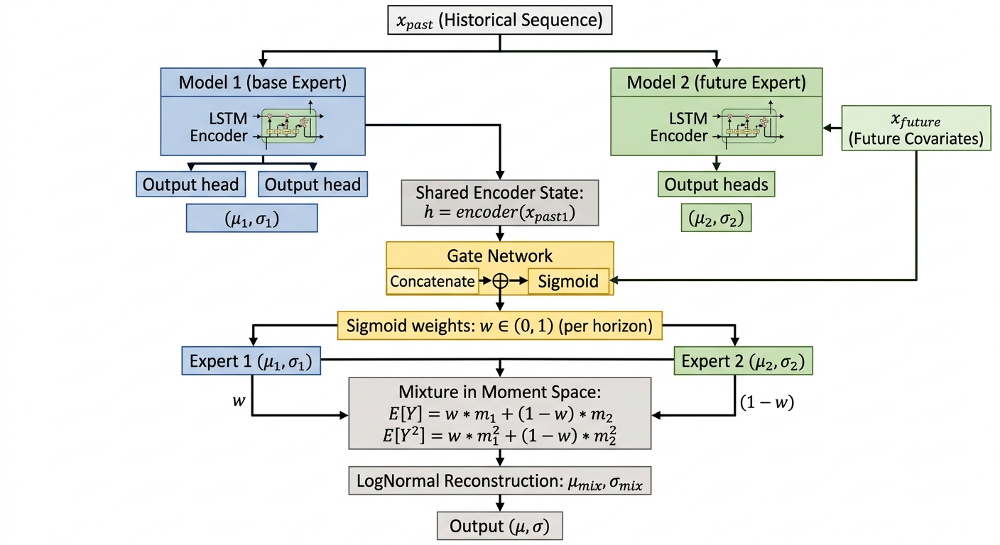
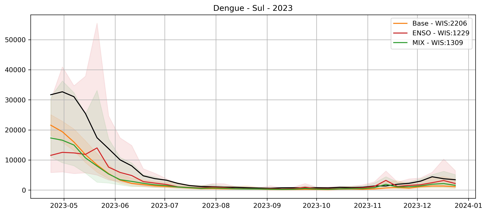
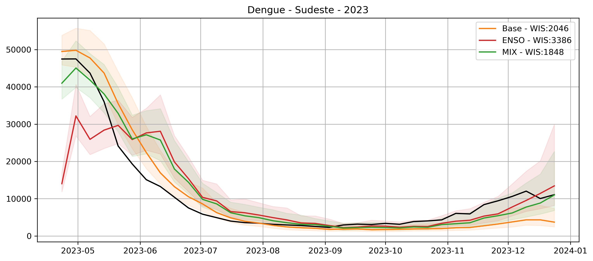
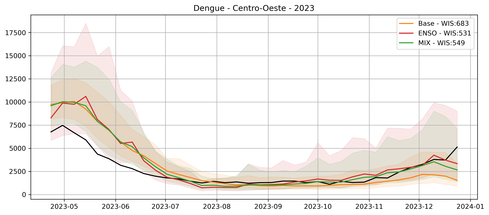
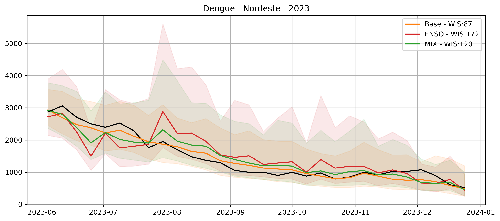
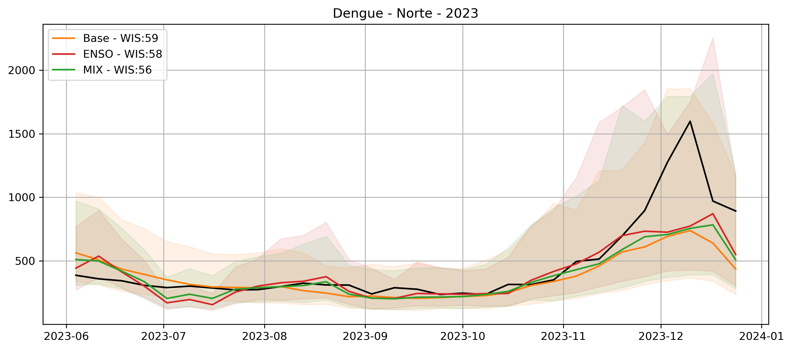

# Modelos para previsão do segundo semestre 

Neste repositório forma implementados três modelos para realizar a previsão das semanas 17-52. Os modelos foram treinados por regional de saúde. Foram utilizados os dados a partir de 2015. Foram desconsideradas para o treinamento as regionais que tiveram menos de 10 casos totais no período de previsão. Foram propostos 3 modelos diferentes usando `pytorch`

## Modelo 1 - Base

Modelo que utiliza como input 'casos','epiweek', 'biome' e 'pop_norm' que é a população normalizada da regional. O modelo retorna os parâmetros de uma distribuição log normal. Abaixo está o diagrama desse modelo: 

## Modelo 2: ENSO

Modelo que inclui as variáveis do modelo de base e também o enso passado e **futuro**. Essa é a estrutura desse modelo: 

O bloco LSTM encoder representa doi layers LSTM intercalados por um layer dropout. 

## Modelo 3 - Combinação dos modelos 1 e 2 

Após rodar alguns testes observou-se que o modelo 1 realiza previsões de curto prazo mais precisas, enquanto o 2, realiza previsões de longo prazo melhores. Assim, foi criado esse modelo que treina os pesos, por horizonte, da combinação dos dois modelos. Esse é o diagrama: 

## Validação dos modelos: 

Para validar os modelos, resolvi treinar eles com dados até 2022 e prever eles para 2023, ano que foi observado um el niño no segundo semestre. Abaixo estão os resultados agregados por região. Para todos as regiões o modelo misturado ficou em primeiro ou segundo lugar: 

